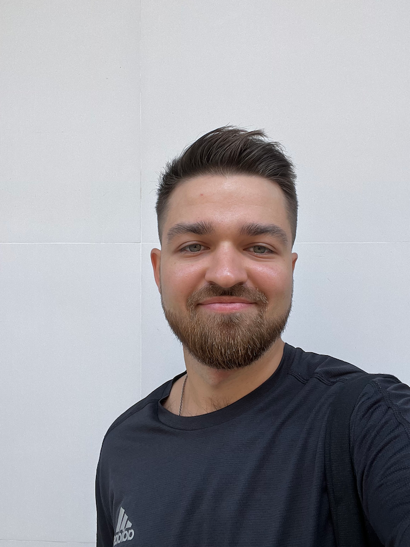

# Hello, I'm PavelBeard 👋

## 👨‍💻 About Me
Hi there! I'm a **Frontend/Fullstack Developer** with a passion for building engaging and user-friendly web applications.  
I am currently looking for exciting job opportunities to further grow and contribute my skills.

---

### 🔍 **What I'm Focused On**
- Exploring and mastering new technologies to stay ahead in the fast-evolving tech landscape.
- Continuously learning and applying these skills to real-world projects.

---

### 🤓 **Currently Working With**
- **Frontend**: React, NextJS  
- **Backend**: Node.js, Django  
- **Databases**: PostgreSQL, MongoDB  
- **Others**: TypeScript, Docker, and more!  

---

### 🗣️ **Languages I Speak**
- 🇪🇸 Spanish (B1)  
- 🇬🇧 English (A2)

---

### 📬 **How to Reach Me**
📧 Email: [pavelborodin0095@gmail.com](mailto:pavelborodin0095@gmail.com)

---

### ⚡️ **Fun Fact**
When I was a student, I used to hate programming. But now, it’s my favorite thing to do! 😄

---

### 📌 **My Projects**
Take a look at my pinned repositories below! 👇
